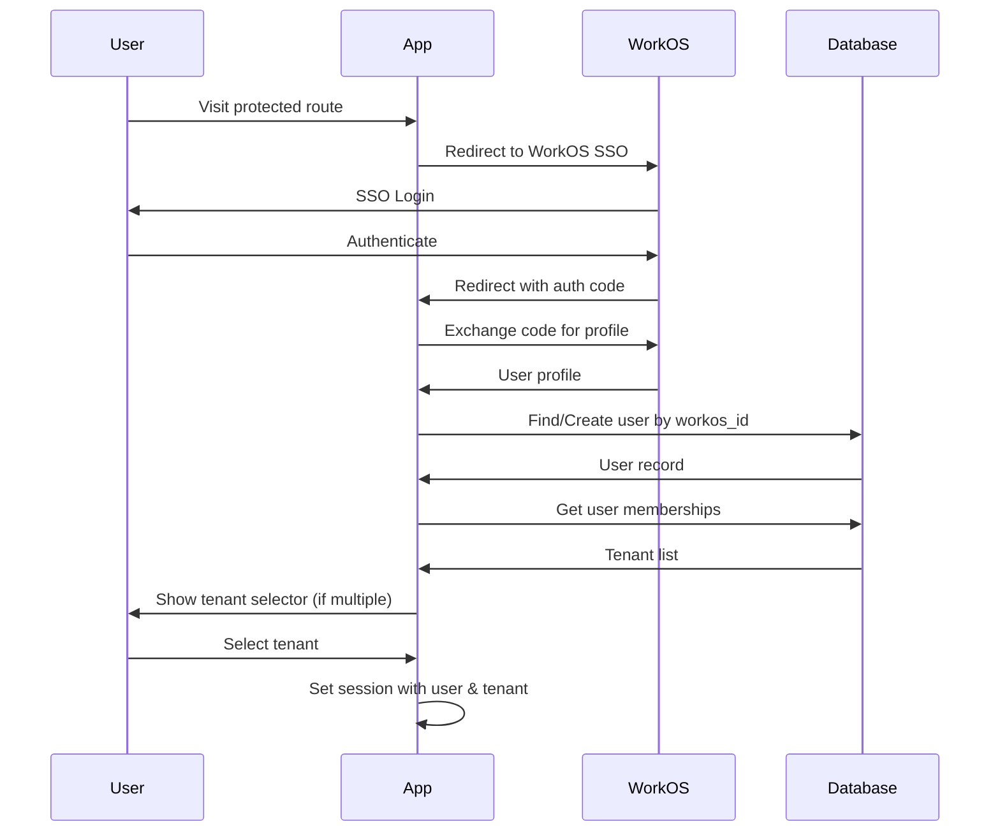

# Multi-Tenant Architecture Design for GeoFleetic

## Overview

This design document outlines the implementation of multi-tenancy in the GeoFleetic application, enabling organizations to manage their fleet data securely and independently. The solution integrates WorkOS for authentication and user management, with shared database architecture using tenant isolation.

## Current Architecture Analysis

### Existing Components
- **Phoenix Framework** with LiveView for real-time dashboards
- **PostgreSQL** with PostGIS for spatial data
- **Real-time Channels** for fleet communication
- **REST API** for external integrations
- **No existing authentication** system

### Multi-Tenancy Touchpoints
- All data models require tenant isolation
- Routes currently use `fleet_id` but lack tenant context
- Channels need tenant-scoped communication
- API endpoints require tenant-aware authentication

## Multi-Tenancy Requirements

### Tenant Definition
- Tenants are organizations that own multiple fleets
- Each tenant's data must be completely isolated
- Users can belong to multiple tenants with different roles
- Tenant switching for users with multiple memberships

### Data Isolation Strategy
- **Shared Database** with `tenant_id` columns
- Row-level filtering on all queries
- No cross-tenant data leakage

## Data Model

### New Schemas

```elixir
# Tenant (Organization)
schema "tenants" do
  field :name, :string
  field :domain, :string  # Optional for SSO
  timestamps()
end

# User
schema "users" do
  field :email, :string
  field :workos_id, :string
  field :first_name, :string
  field :last_name, :string
  timestamps()
end

# Membership
schema "memberships" do
  field :role, :string  # "admin", "member"
  belongs_to :user, User
  belongs_to :tenant, Tenant
  timestamps()
end

# Fleet
schema "fleets" do
  field :name, :string
  belongs_to :tenant, Tenant
  timestamps()
end
```

**Note:** Using standard bigint primary keys for compatibility with existing database structure.

### Modified Existing Schemas

All existing tables will add `tenant_id`:

```elixir
schema "vehicle_locations" do
  field :vehicle_id, :string
  field :location, Geo.PostGIS.Geometry
  # ... other fields
  belongs_to :tenant, Tenant
  timestamps()
end
```

## Authentication & Authorization Flow

### WorkOS Integration



### Authorization Policies

- **Admin**: Full CRUD on tenant resources, manage users
- **Member**: Read/write fleet data, limited user management
- **Row-level**: All queries filtered by `tenant_id`

## Database Schema Changes

### Migrations Required

1. Create `tenants` table
2. Create `users` table
3. Create `memberships` table
4. Create `fleets` table
5. Add `tenant_id` to existing tables:
   - `vehicle_locations`
   - `geofences`
   - And others as identified

### Migration Example

```elixir
def change do
  create table(:tenants) do
    add :name, :string, null: false
    add :domain, :string
    timestamps()
  end

  alter table(:vehicle_locations) do
    add :tenant_id, references(:tenants, on_delete: :delete_all), null: false
  end
end
```

## API Changes

### Route Updates

```elixir
# Before
get "/vehicles/:fleet_id", VehicleController, :index

# After
get "/:tenant_id/vehicles/:fleet_id", VehicleController, :index
```

### Controller Changes

```elixir
def index(conn, %{"tenant_id" => tenant_id, "fleet_id" => fleet_id}) do
  # Verify tenant access
  vehicles = Vehicle
    |> where(tenant_id: ^tenant_id)
    |> where(fleet_id: ^fleet_id)
    |> Repo.all()

  render(conn, :index, vehicles: vehicles)
end
```

## Frontend Changes

### LiveView Updates

```elixir
def mount(%{"tenant_id" => tenant_id}, session, socket) do
  tenant = get_tenant(tenant_id)
  user = get_current_user(session)

  # Verify membership
  if authorized?(user, tenant) do
    {:ok, assign(socket, tenant: tenant, current_user: user)}
  else
    {:ok, redirect(socket, to: "/unauthorized")}
  end
end
```

### Component Updates

All components must receive and use `tenant_id` for data filtering.

## Security Measures

### Plugs

```elixir
# Authentication Plug
def call(conn, _opts) do
  case get_session(conn, :user_id) do
    nil -> redirect_to_login(conn)
    user_id -> assign(conn, :current_user, Repo.get(User, user_id))
  end
end

# Tenant Context Plug
def call(conn, _opts) do
  tenant_id = conn.params["tenant_id"]
  tenant = Repo.get(Tenant, tenant_id)

  if tenant_access?(conn.assigns.current_user, tenant) do
    assign(conn, :current_tenant, tenant)
  else
    conn |> put_status(403) |> halt()
  end
end
```

### Policies

```elixir
defp can?(user, :manage_users, tenant) do
  membership = Repo.get_by(Membership, user_id: user.id, tenant_id: tenant.id)
  membership && membership.role == "admin"
end
```

## Implementation Plan

### Phase 1: Core Infrastructure
1. Add WorkOS dependency
2. Create tenant/user schemas
3. Implement authentication flow
4. Add tenant context plugs

### Phase 2: Data Migration
1. Create migrations for new tables
2. Add tenant_id to existing tables
3. Migrate existing data (if any)

### Phase 3: Application Updates
1. Update routes with tenant_id
2. Modify controllers for tenant filtering
3. Update LiveViews and components
4. Test tenant isolation

### Phase 4: Testing & Security
1. Write comprehensive tests
2. Security audit
3. Performance testing
4. Documentation updates

## Risks & Considerations

- **Data Migration**: Ensure all existing data gets proper tenant_id
- **Performance**: Add indexes on tenant_id columns
- **User Experience**: Smooth tenant switching for multi-tenant users
- **WorkOS Limits**: Monitor API rate limits
- **Backup Strategy**: Tenant-aware backup/restore procedures

## Success Metrics

- Zero cross-tenant data leakage
- <2s authentication time
- 99.9% uptime for tenant switching
- Full audit trail of tenant actions